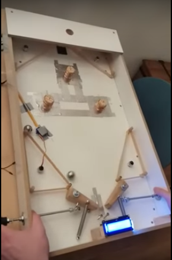
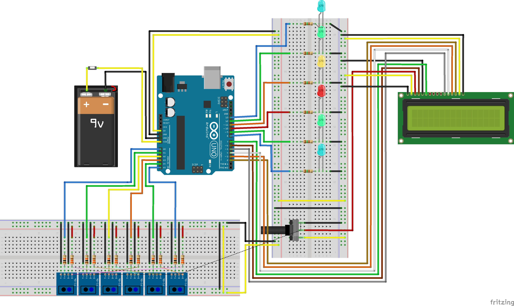
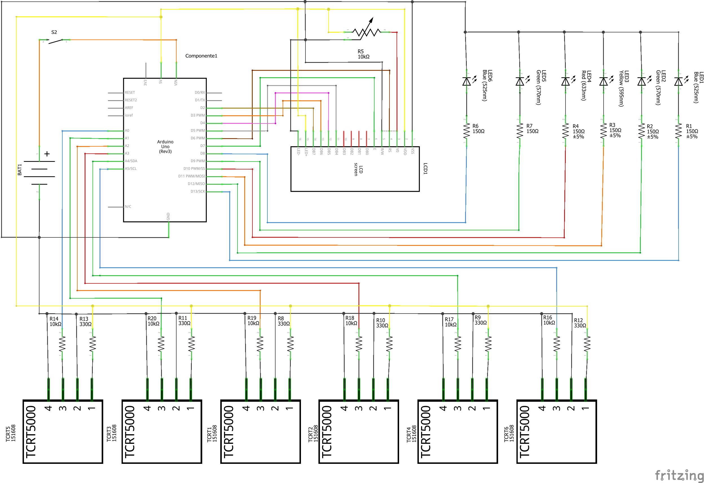

# 1 OBJETIVO

## 1.1 Projeto Pinball

Desenvolver um brinquedo simples para crianças com transtorno de especto
autista (TEA) que envolva circuitos elétricos.  
O projeto é um pinball, de dimensões portatil (um pouco maior que uma
caixa de sapatos), construido com *Arduino UNO R3*, seis *LEDs* e seis
sensores que mapeiam a movimentação da bola. Com base no mapeamento da
movimentação da bola os pontos do jogo são marcados ou a partida é
reiniciada.  

<figure>

<figcaption aria-hidden="true">Exemplo pinball construido a partir de
Arduino</figcaption>
</figure>

## 1.2 O que é o Arduino

O Arduino é uma pequena placa de microcontrolador. Contém diversos
terminais que permitem a conexão com dispositivos externos. Os Arduinos
podem ser energizados por um computador através de um plugue USB, por
uma bateria 9V ou por uma fonte de alimentação. Eles podem ser
programados pelo computador e, em seguida, desconectados, permitindo
assim que trabalhem independentemente do computador.Evans, Noble e
Hochenbaum (2013)  

# 2 LISTA DE MATERIAIS

| Materiais                                      | Quantidade |
|:-----------------------------------------------|:----------:|
| Arduino UNO R3                                 |     1      |
| Case para Arduino UNO                          |     1      |
| LED Difuso 5mm Vermelho                        |     1      |
| LED Difuso 5mm Amarelo                         |     1      |
| LED Difuso 5mm Azul                            |     2      |
| LED Difuso 5mm Verde                           |     2      |
| Resistor de 330 Ohm                            |     6      |
| Resistor de 150 Ohm                            |     6      |
| Resistor de 10k Ohm                            |     6      |
| Potenciometro 10k                              |     1      |
| Display LCD 16×2 Backlight Verde               |     1      |
| Sensor Óptico Reflexivo TCRT5000               |     6      |
| Cabos Jumper macho-macho                       |     1      |
| Tubo Termo Retrátil                            |     1      |
| Protoboard                                     |     2      |
| Suporte Bateria 9V Plug P4                     |     1      |
| Bateria Recarregável 9v De Litio 680mah Rontek |     1      |
| Bolinha de Gude                                |     1      |

Lista de materiais

# 3 DESENVOLVIMENTO

## 3.1 Circuito

### 3.1.1 *Software* de desenho do circuito

Para os desenhos do circuito foi utilizado o software tipo *CAD*
[*Fritzing*](https://fritzing.org/), de codigo aberto, na versão beta. O
software oferece a possibilidade de desenhar tanto o modelo *breadboard*
quando o esquemático do circuito com arduino, sendo suas vantagens uma
biblioteca de dispositivos eletrônicos vasta, uma comunidade ativa para
tirar dúvidas e a criação de novos dispositivos eletrônicos.  

### 3.1.2 Breadboard

<figure>

<figcaption aria-hidden="true">Circuito do Arduino com seis sensores
ópticos, seis <em>LEDs</em> e um <em>LCD</em></figcaption>
</figure>

### 3.1.3 Diagrama esquemático

<figure>

<figcaption aria-hidden="true">Diagrama Esquemático do circuito do
Arduino com seis sensores ópticos, seis <em>LEDs</em> e um
<em>LCD</em></figcaption>
</figure>

## 3.2 Testes

Antes do projeto finalizado, foram feitos dois testes do prototipo do
circuito eletrônico.  

1.  O primeiro para averiguar como seria o circuito na sua forma mais
    simples, apenas um sensor óptico, um *LED* e uma placa de *LCD*, e a
    programação básica do Arduino para essa situação.  
    Os principais fatores considerados foram:  

-   A estrutura básica do circuito.  
-   O funcionamento do *LCD*.  
-   A programação base emplementada para unir esses componentes (sensor
    óptico, *LED* e placa de *LCD*).  

1.  O segundo experimento foi para ampliar o circuito, tornando mais
    proximo do real, seis sensores e seis *LEDs*, averiguar a
    programação como observada no Apêndice A com suas peculiaridades
    de:  

-   Definir os pinos de cada componente eletrônico.  
-   A disposição e o sistema de cores definido para os *LEDs*,
    relacionando os sensores e *LEDs*.  
-   Transformação de pinos analógicos para digitais no *Arduino* através
    de programação, para comportar todos os componentes.  
-   Testar da estrutura condicional (*if-else*) da programação.  
-   O tempo ideal de *delay* para reconhecimento dos sensores do
    objeto.  
-   Definir e testar o sistema de pontuação do jogo.  

## 3.3 Bateria

Sobre a escolha da bateria, o tipo de bateria que ofereceria um melhor
desempenho para o projeto funcionar por varias horas e ainda sendo
recarregavel é o modelo *Bateria Recarregável 9v De Litio 680mah Rontek*
pelo preço de aproximadamente R$
[135,00](https://www.magazineluiza.com.br/bateria-recarregavel-9v-de-litio-680mah-rontek/p/jgfeg3d9a7/ea/rapo/),
apresentando assim um alto custo. Foi escolhido para baratear o projeto
a *bateria duracell alcalina 9v*, sendo esta mais usual, com bom
desempenho, apesar de não ser recarregavele e ter por volta de 3 a 4
horas de vida utíl com o Pinball em funcionamento, pelo preço de
aproximadamente R$
[25,00](https://www.magazineluiza.com.br/bateria-duracell-alcalina-9v-preto-e-laranja-9v-1/p/dc3hca11h7/cj/batr/).
Esta última serve aos propositos do projeto para demonstração.  

# 4 MONTAGEM DO PINBALL

Foi projetado a estrutura do pinball e com base nas medidas foi possível
mensurar as distâncias de fios e a disposição dos dispositivos
eletrônicos no Pinball.  

# 5 CONCLUSÃO

# 6 APÊNDICE A - PROGRAMAÇÃO

    //Bibliotecas
    #include <LiquidCrystal.h>

    //Definindo os pinos que serão utilizados para ligação ao display LCD
    LiquidCrystal lcd(6, 7, 5, 4, 3, 2);

    //Definindo pinos dos LED
    int pinoLed_1 = 13; //Pino digital utilizado pelo LED 1 - Azul
    int pinoLed_2 = 12; //Pino digital utilizado pelo LED 2 - Verde
    int pinoLed_3 = 11; //Pino digital utilizado pelo LED 3 - Amarelo
    int pinoLed_4 = 10; //Pino digital utilizado pelo LED 4 - Vermelho
    int pinoLed_5 = 9; //Pino digital utilizado pelo LED 5 - Verde
    int pinoLed_6 = 8; //Pino digital utilizado pelo LED 6 - Azul

    // Cores LED e Pontos
    // Azul = LED 1 e 6 = 1 ponto
    // Verde = LED 2 e 5 = 2 ponto
    // Amarelo = LED 3 = 3 ponto
    // Vermelho = LED 4 = 0 ponto

    //Definindo pinos dos sensores óptico tcrt5000
    int pinoSensor_1 = 14; //Pino analogico A0 transformado em pino digital utilizado pelo sensor 1
    int pinoSensor_2 = 15; //Pino analogico A1 transformado em pino digital utilizado pelo sensor 2
    int pinoSensor_3 = 16; //Pino analogico A2 transformado em pino digital utilizado pelo sensor 3
    int pinoSensor_4 = 17; //Pino analogico A3 transformado em pino digital utilizado pelo sensor 4
    int pinoSensor_5 = 18; //Pino analogico A4 transformado em pino digital utilizado pelo sensor 5
    int pinoSensor_6 = 19; //Pino analogico A5 transformado em pino digital utilizado pelo sensor 6

    // Relação entre LED e sensores - Pinos
    // pinoSensor_1 -> pinoLed_1 - Pinos A0 e 13
    // pinoSensor_2 -> pinoLed_2 - Pinos A1 e 12
    // pinoSensor_3 -> pinoLed_3 - Pinos A2 e 11
    // pinoSensor_4 -> pinoLed_4 - Pinos A3 e 10
    // pinoSensor_5 -> pinoLed_5 - Pinos A4 e 9
    // pinoSensor_6 -> pinoLed_6 - Pinos A5 e 8

    // Variáveis
    int point = 0; //Contador de pontos
    int stop = 500; //Tempo de parada para o delay

    void setup() {
      //Define o número de colunas e linhas do LCD
      lcd.begin(16, 2);
      
      // Inicializando os Sensores
      pinMode(pinoSensor_1, INPUT); //Definindo o pino como entrada para o sensor 1
      pinMode(pinoSensor_2, INPUT); //Definindo o pino como entrada para o sensor 2
      pinMode(pinoSensor_3, INPUT); //Definindo o pino como entrada para o sensor 3
      pinMode(pinoSensor_4, INPUT); //Definindo o pino como entrada para o sensor 4
      pinMode(pinoSensor_5, INPUT); //Definindo o pino como entrada para o sensor 5
      pinMode(pinoSensor_6, INPUT); //Definindo o pino como entrada para o sensor 6

      // Inicializando os LED
      pinMode(pinoLed_1, OUTPUT); //Definindo o pino como saída para o LED 1 - Verde
      pinMode(pinoLed_2, OUTPUT); //Definindo o pino como saída para o LED 2 - Azul
      pinMode(pinoLed_3, OUTPUT); //Definindo o pino como saída para o LED 3 - Amarelo
      pinMode(pinoLed_4, OUTPUT); //Definindo o pino como saída para o LED 4 - Vermelho
      pinMode(pinoLed_5, OUTPUT); //Definindo o pino como saída para o LED 5 - Verde
      pinMode(pinoLed_6, OUTPUT); //Definindo o pino como saída para o LED 6 - Azul
      
      // Desligando os LED
      digitalWrite(pinoLed_1, LOW); //LED 1 inicia desligado
      digitalWrite(pinoLed_2, LOW); //LED 2 inicia desligado
      digitalWrite(pinoLed_3, LOW); //LED 3 inicia desligado
      digitalWrite(pinoLed_4, LOW); //LED 4 inicia desligado
      digitalWrite(pinoLed_5, LOW); //LED 5 inicia desligado
      digitalWrite(pinoLed_6, LOW); //LED 6 inicia desligado
    }

    void loop() {
      //Sensor
      if (digitalRead(pinoSensor_1) == LOW){ //Se a leitura do sensor 1 (Azul) for igual a LOW, faz
        digitalWrite(pinoLed_1, HIGH); //Acende o LED 1 - Azul
        point=point+1; //Adiciona 1 ponto
      }else if(digitalRead(pinoSensor_2) == LOW){ //Se a leitura do sensor 2 (Verde)) for igual a LOW, faz
        digitalWrite(pinoLed_2, HIGH); //Acende o LED 2 - Verde
        point=point+2; //Adiciona 2 ponto
      }else if(digitalRead(pinoSensor_3) == LOW){ //Se a leitura do sensor 3 (Amarelo) for igual a LOW, faz
        digitalWrite(pinoLed_3, HIGH); //Acende o LED 3 - Amarelo
        point=point+3; //Adiciona 3 ponto
      }else if(digitalRead(pinoSensor_5) == LOW){ //Se a leitura do sensor 5 (Verde) for igual a LOW, faz
        digitalWrite(pinoLed_5, HIGH); //Acende o LED 5 - Verde
        point=point+2; //Adiciona 2 ponto
      }else if(digitalRead(pinoSensor_6) == LOW){ //Se a leitura do sensor 6 (Azul) for igual a LOW, faz
        digitalWrite(pinoLed_6, HIGH); //Acende o LED 6 - Azul
        point=point+1; //Adiciona 1 ponto
      }else if(digitalRead(pinoSensor_4) == LOW){ //Se a leitura do sensor 4 (Vermelho) for igual a LOW, faz
        digitalWrite(pinoLed_4, HIGH); //Acende o LED 4 - Vermelho
        point=0; //Reinicia a contagem
      }
      
      //LCD
      //Limpa a tela
      lcd.clear();
      //Posiciona o cursor na coluna 1, linha 0;
      lcd.setCursor(1, 0);
      //Envia o texto entre aspas para o LCD
      lcd.print("Jogo Placar");
      //Posiciona o cursor na coluna 1, linha 1;
      lcd.setCursor(1, 1);
      //Imprime Contador de pontuação
      lcd.print(point);
      delay(stop);
      
      // Apagar LED
      digitalWrite(pinoLed_1, LOW); //Apaga o LED 1
      digitalWrite(pinoLed_2, LOW); //Apaga o LED 2
      digitalWrite(pinoLed_3, LOW); //Apaga o LED 3
      digitalWrite(pinoLed_4, LOW); //Apaga o LED 4
      digitalWrite(pinoLed_5, LOW); //Apaga o LED 5
      digitalWrite(pinoLed_6, LOW); //Apaga o LED 6
    }

# 7 BIBLIOGRAFIA

EVANS, M.; NOBLE, J.; HOCHENBAUM, J. **[Arduino em
Ação](https://books.google.com.br/books?id=tig0CgAAQBAJ)**. \[s.l.\]
Novatec Editora, 2013.

MONK, S. **Programação com Arduino: começando com Sketches**. \[s.l.\]
Bookman Editora, 2013.

\_\_\_. **Programação com Arduino II: Passos avançados com sketches**.
\[s.l.\] Bookman Editora, 2015.
